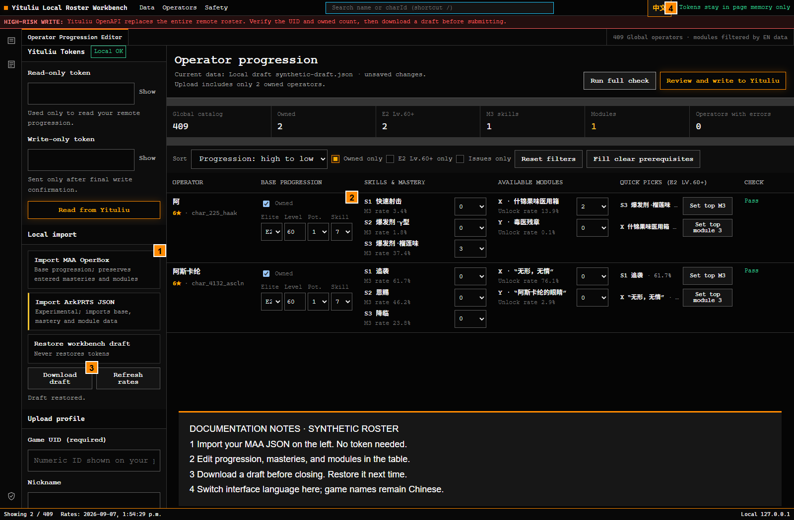
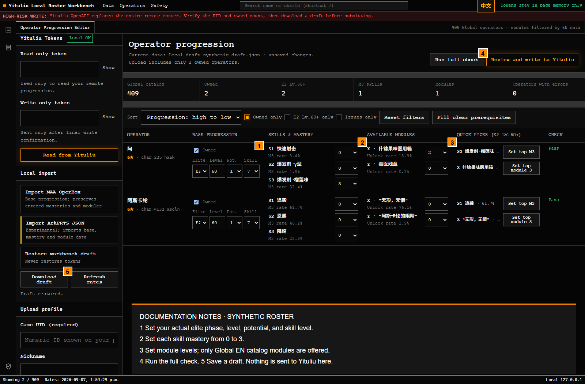
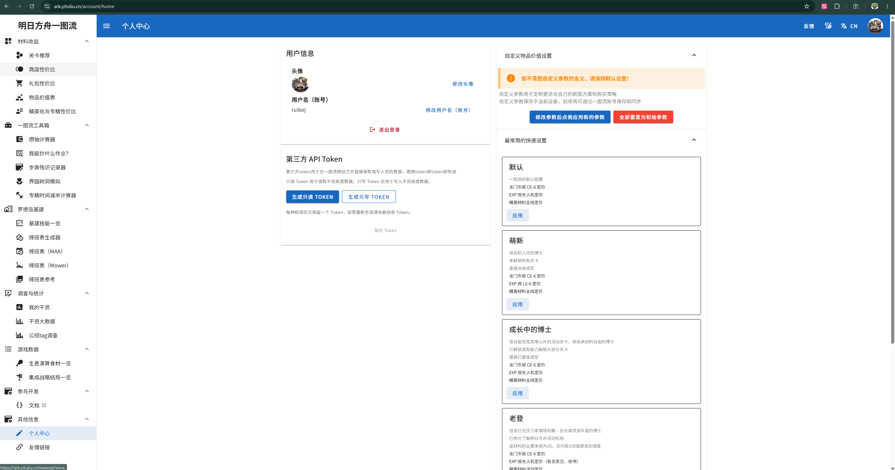

# Yituliu Roster Workbench

[中文说明](README.zh-CN.md) · [Download for Windows](https://github.com/ruiboj/yituliu-global-roster-workbench/releases/latest)

A local Arknights roster editor for Global players. Import a MAA export, fill in masteries and modules, and save a draft. If you have Yituliu read/write tokens, you can also load and replace your roster there.

**You do not need a token to import files, edit operators, or save a draft.** This tool does not obtain a CN game token or log you into Yituliu.



## Download and open

1. Open [the latest release](https://github.com/ruiboj/yituliu-global-roster-workbench/releases/latest). Download **Yituliu-Workbench-Windows-x64-v3.1.1.zip** under **Assets**. The GitHub “Source code” downloads are for development.
2. Right-click the ZIP and choose **Extract All**. Open the extracted folder.
3. Double-click **Start.cmd**. On first launch, it downloads the public game catalog. Your browser opens automatically when it is ready.
4. Keep the command window open while using the app. Save a draft before closing the browser; close the command window to stop the local server.

No Node.js installation, terminal commands, administrator rights, or separate HTML-opening step are required. The package includes Node.js 22 for Windows x64. First launch needs internet access to GitHub and Yituliu; later local editing uses the saved catalog. Remote reads, writes, and statistics refreshes still need internet.

The repository and release downloads are public. No GitHub account is needed to download the Windows ZIP.

## Import, edit, save

**1 — Import.** Use **Import MAA OperBox** and select `Arknights_OperBox_Export.json` from MAA. Basic progression is merged by operator ID; previously entered masteries and modules are preserved. Check the owned count after importing because OCR can miss or misread operators. To start manually, turn off **Owned only** so the empty catalog is visible, then mark your operators as owned.

**2 — Edit.** Search by the displayed Chinese name or charId. Set ownership, elite phase, level, potential, skill level, masteries, and modules. The **EN / 中文** button changes interface labels; game names remain Chinese. Module choices are filtered against the Global EN data table.



The quick mastery and module buttons are available for owned operators at E2 Lv.60 or above. They use the highest investment rates in Yituliu’s survey, not a strength ranking. Clicking one changes your draft; use it only when it matches your actual account. Some edits fill in prerequisites, such as skill level 7 for mastery, so review those changes too.

**3 — Check and back up.** Run **Run full check**, resolve the errors, then choose **Download draft**. Use **Restore workbench draft** next time. Closing or refreshing the page discards unsaved edits. A draft contains progression and any profile details you entered, but no tokens.

## Get your Yituliu tokens

1. Sign in to your **Yituliu account**, then open [Personal Center / 个人中心](https://ark.yituliu.cn/account/home). You can also select **个人中心** near the bottom of the left sidebar.
2. Find the **第三方 API Token** (Third-party API Token) card below your user information.
3. Click **生成只读 TOKEN** (Generate read-only token). Copy the generated value into this workbench’s **Read-only token** field to load your Yituliu roster.
4. If you want to save your edited roster to Yituliu, click **生成只写 TOKEN** (Generate write-only token) and paste that value into **Write-only token**. It is used only after you review and confirm the write.

These are **Yituliu third-party API tokens**, not a CN Arknights game token or a Yostar login credential. Local import, editing, and draft saving still work without them.



The screenshot shows the Chinese site labels. **只读 = read-only; 只写 = write-only.** Yituliu allows one token of each permission type. If one already exists, delete the old token before generating its replacement; the old value will stop working, so update any tools using it. Keep generated values private.

## Send a roster to Yituliu (optional)

Use your own Yituliu tokens, if available. The read-only token loads the existing remote roster; the write-only token is used only after the final write confirmation.

1. Verify your UID, owned count, and progression.
2. Download a draft before writing.
3. Choose **Review and write to Yituliu** and review the confirmation.
4. Read the roster back with the read-only token and compare it.

**Writing replaces the entire remote roster.** It is not an update of just the visible or edited rows. Real account writes have not been exercised in release testing.

Tokens stay in page memory and pass through a server bound to `127.0.0.1`. They are not saved in drafts or browser storage. Do not share account exports, drafts, or tokens in issues or screenshots.

## If something goes wrong

| What you see | What to do |
| --- | --- |
| Windows warns about a downloaded file | The launcher is an unsigned script. Windows policy and file reputation can still produce a warning. Check that the ZIP came from this repository; do not disable Windows protection. A CMD launcher cannot guarantee no warning. |
| Browser did not open | Keep the command window open and visit `http://127.0.0.1:38471/`. |
| “Port may already be in use” | Close the previous workbench command window and try again. |
| First download fails | Read the error in the command window, check your connection, and run Start.cmd again. |
| New operator or module is missing | Save your draft, run **Update-catalog.cmd**, then reload and restore your draft. **Refresh rates** updates statistics only. |
| Page fails after opening index.html | Close it and use **Start.cmd**. The app needs its local server. |
| Missing bundled runtime | Extract the complete Windows-x64 release ZIP. Source ZIPs do not include Node.js. |

Microsoft explains [how SmartScreen evaluates downloaded applications](https://learn.microsoft.com/en-us/windows/apps/package-and-deploy/smartscreen-reputation). This release does not install a service or change system security settings.

## Experimental ArkPRTS import

The app can import ArkPRTS JSON. The optional `导出国际服干员_实验性.cmd` exporter requires Python 3 and a separate `py -m pip install -U arkprts`. It supports EN/JP/KR email verification and asks you to acknowledge the risks before login. It is not needed for the normal workflow.

ArkPRTS uses unofficial Yostar endpoints; login may disconnect the game session and upstream changes may break it. Prefer MAA or manual editing if you do not want to use it. Never share raw account responses or verification codes.

## Development and releases

With Node.js 18+ installed:

```powershell
npm run data:update
npm test
npm run release:portable
```

The Windows package contains the app, a checksum-verified official Node.js binary, and its license. Game catalog data is generated on the user’s machine and excluded from Git and the portable ZIP. The original offline-runtime packaging option remains gated by explicit redistribution permission.

[Publishing guide](PUBLISHING.md) · [Design notes](DESIGN_AND_RISKS.md) · [Third-party notices](THIRD_PARTY_NOTICES.md) · [Security](SECURITY.md) · [Changelog](CHANGELOG.md)

Unofficial fan utility. Not affiliated with Hypergryph, Yostar, Yituliu, MAA, or ArkPRTS. The MIT license covers original project code, not game content or third-party data.
